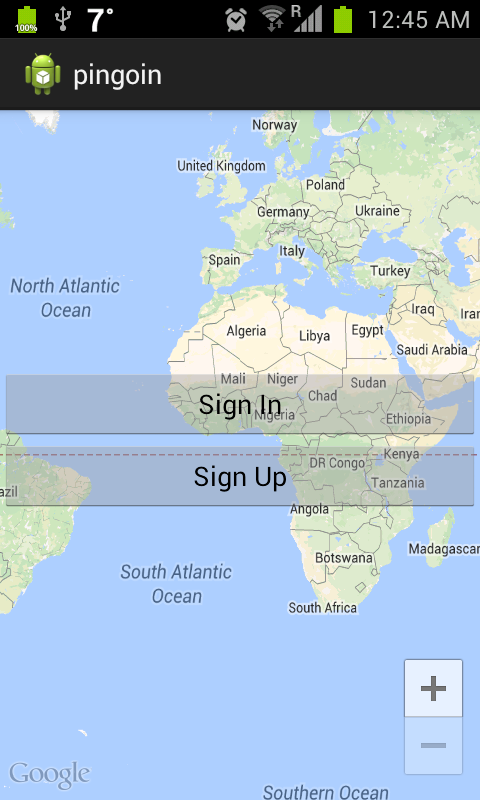
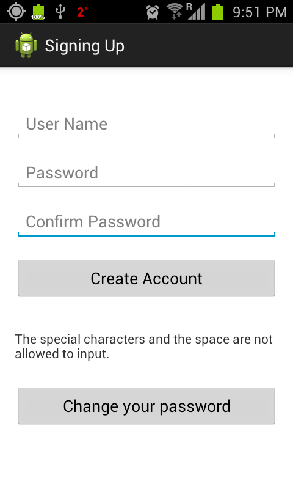
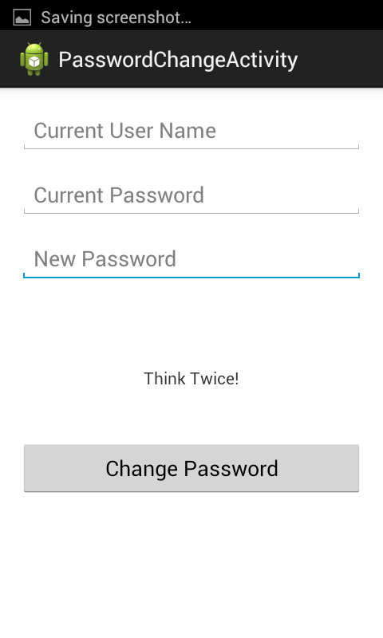
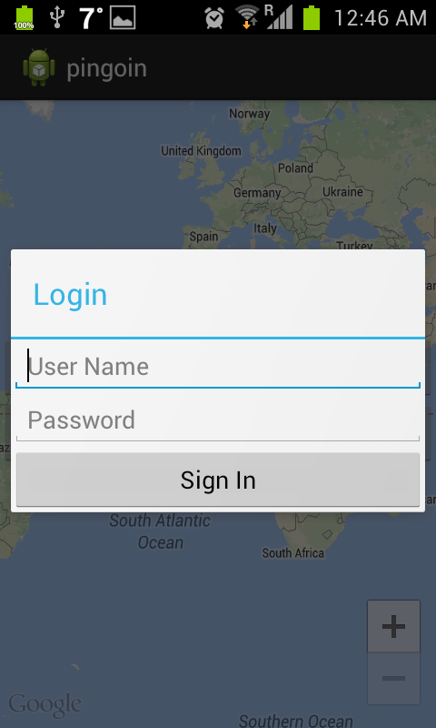
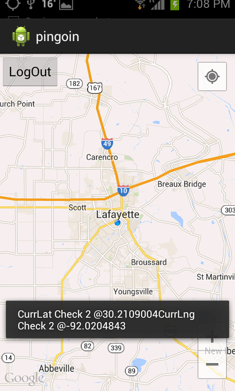
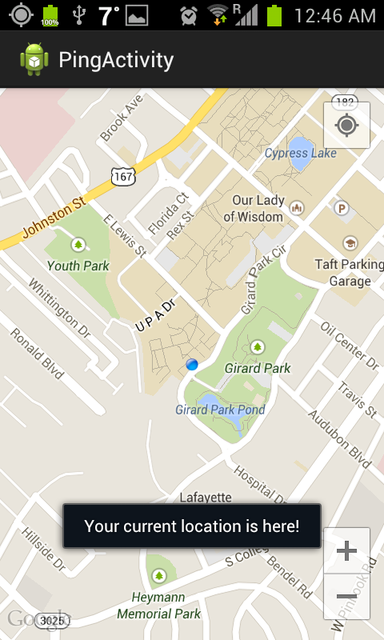
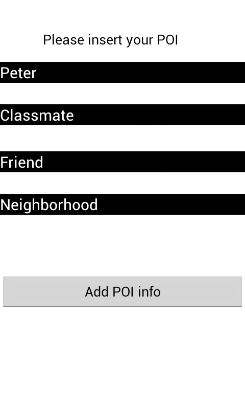
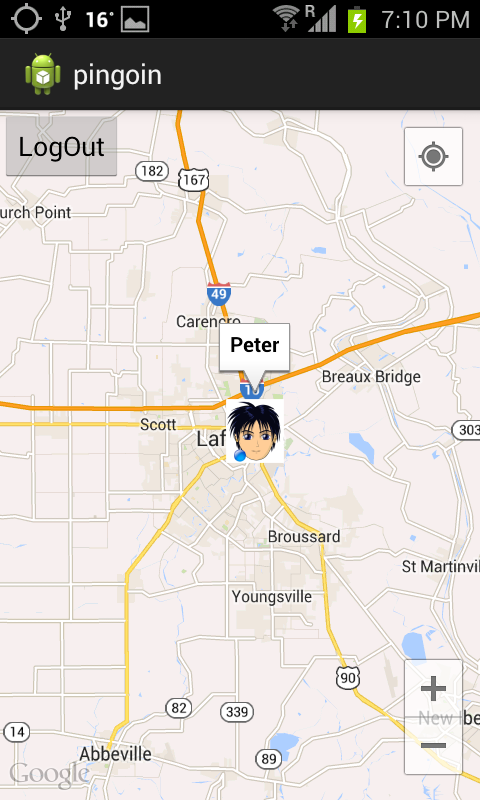
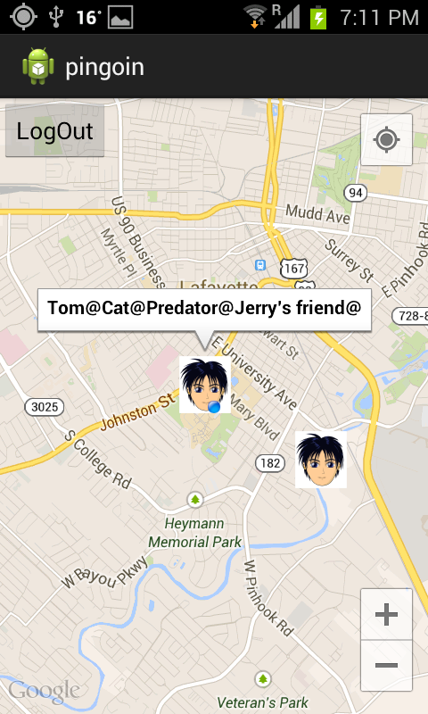
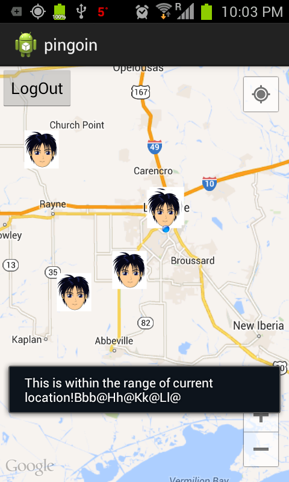

#pingoin
    Author: Tung Thanh Le
    Contact: ttungl at gmail dot com
    
###Mobile Application: 
Pingo'in [android app] is created by using a Google maps API. You can build your list of points of interest (POI) on the Googlemap, then the application will scan your map in the preset radius, if your POIs are within this radius, they will be displayed on your screen. Used Java, Eclipse for building the app, and used SVN for merging the code project.

###Screenshots

