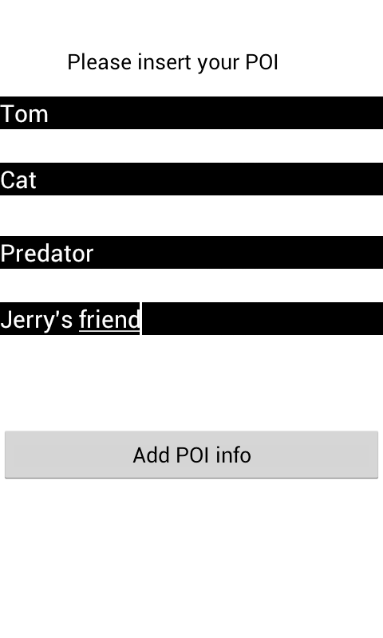

#pingoin
    Author: Tung Thanh Le
    Contact: ttungl at gmail dot com
    
###Mobile Application: 
Pingo'in [android app] is created by using a Google maps API. You can build your list of points of interest (POI) on the Googlemap, then the application will scan your map in the preset radius, if your POIs are within this radius, they will be displayed on your screen. Used Java, Eclipse for building the app, and used SVN for merging the code project.

###My Tasks
* `Authentication`, `Sign-in`, `Sign-up`, `Password-change`.
* `Relative Distance` from the current location: If the saved points of interest are within the preset radius of the current GPS location, all those points will be popped up and you touch on selected icons to go into detail. The positions are based on the longtitude and lattitude, getting from Google Map API. The distances from an object to other ones are on the sphere as are calculated as follows.


```
Assume that two points of interest P1(Lat1,Long1) and P2(Lat2,Long2), the unit is converted 
from the degree to radian as we are calculating the distance in the sphere (great-circle distance) [1, 2].
delta_Lat = Lat2-Lat1
delta_Long = Long2-Long1
Earth radius = 6371 km

// A is the square of half the chord length between the points.
A = sin(delta_Lat/2)*sin(delta_Lat/2) + cos(Lat1)*cos(Lat2)*sin(delta_Lng/2)*sin(deltaLng/2); 

// C is the angular distance in radians.
C = 2*atan2(sqrt(A),sqrt(1-A));

Distance = Earth radius * C ; if you want to get in kilometers; 
[optional] Distance = Earth radius * C * 1000 ; if you want to get in meters;

References:
[1] http://www.movable-type.co.uk/scripts/latlong.html
[2] http://en.wikipedia.org/wiki/Great-circle_distance
```

###Screenshots





Note: Database part has been done by my teammates. This part basically is a local database, using SQLite to store the users' information;
